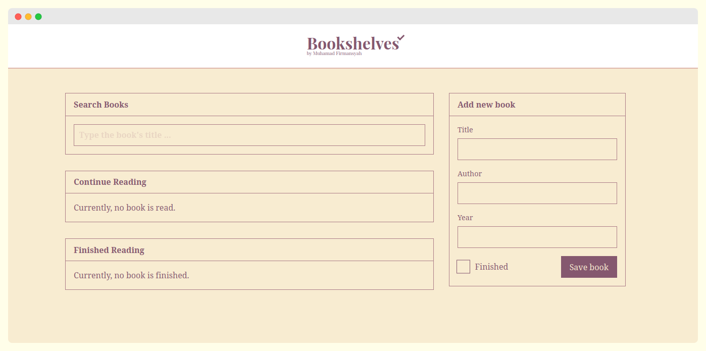
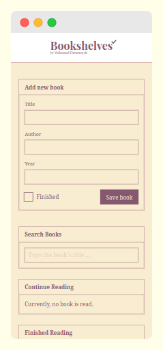

# Bookshelves - TODO manager

Bookshelves is reading-book TODO manager that stored the data in the browser's local-storage.

  
### UI
<table>
    <tr>
        <td>
            
        </td>
        <td>
            
        </td>
    </tr>
</table>

### Resources
- Fonts: "Noto Serif" from [Google Fonts](https://fonts.google.com)
- Color Palette: [colorhunt.co](https://colorhunt.co/palette/f8ecd1deb6abac7d8885586f)